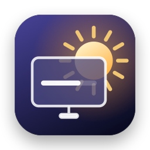
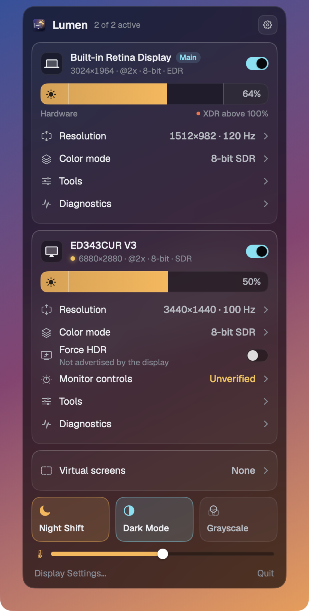
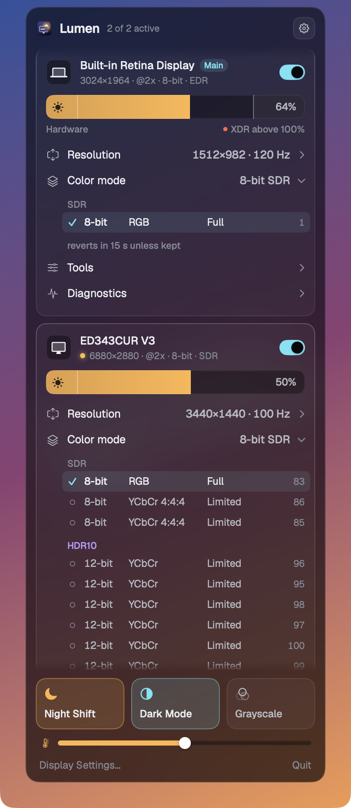
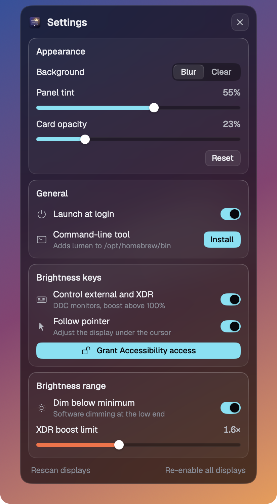

<p align="center">
  
</p>

<h1 align="center">Lumen</h1>

<p align="center">
  A native macOS menu-bar app for controlling every display you own: brightness, XDR, resolution, color modes, HDR, virtual screens. It ships with a <code>lumen</code> command-line tool.<br>
  Free and open source, with the "Pro" features included.
</p>

<p align="center">
  
  &nbsp;
  
</p>

---

## Features

### Brightness
- **One slider per display.** It uses the right mechanism for each display: the panel's own backlight for the built-in screen, **DDC/CI** for external monitors, and software (gamma) dimming when neither is available.
- **Dim below minimum.** The bottom of the slider keeps dimming past the darkest hardware setting.
- **XDR boost.** On Liquid Retina XDR MacBooks the top of the slider goes past 100% SDR brightness, using the panel's EDR headroom. The limit is adjustable (default 1.6×).
- **Brightness keys for any display.** F1/F2 adjust the display under the pointer: external monitors over DDC, and XDR/dimming at either end of the built-in range. An on-screen HUD shows the level.

### Resolution & color
- Resolution slider plus every mode the display offers, including all **HiDPI** variants, with a refresh-rate picker.
- **Color modes** set how the Mac sends pixels down the cable. You choose bit depth (8/10/12-bit), **RGB or YCbCr**, **full or limited range**, and **SDR / HDR10 / HLG**, read directly from the Apple Silicon display controller. Every change reverts after 15 s unless you confirm it, so a bad mode can't leave you with a black screen.
- **HDR** on/off, and **Force HDR** for monitors that support HDR signals but don't advertise them to macOS.
- Per-display **invert colors**, plus system **grayscale**, **Night Shift** (with warmth) and **Dark Mode**.

### Displays & virtual screens
- Turn displays **on/off** without unplugging them. This only lasts for the session, and displays always come back when Lumen quits or relaunches.
- **Mirror**, **make main display**.
- **Virtual screens** of any size, optionally HiDPI. Show one on a physical display to get **any scaled resolution** ("flexible scaling").
- **Viewer window:** a live picture-in-picture of any display, with invert, grayscale, flip, rotate, opacity and keep-on-top.

### Monitor controls (DDC/CI)
- Contrast, volume, mute and **input source switching** for external monitors.

### Diagnostics
- Per-display readout: IDs, EDID vendor/model/serial, panel size and density, framebuffer vs. logical resolution, link color mode and timing, EDR headroom, HDR state, DDC status, gamma state.

<p align="center">
  
</p>

## Install

1. Download **Lumen.zip** from the [latest release](../../releases/latest) and move `Lumen.app` to `/Applications`.
2. Lumen is ad-hoc signed, not notarized. On first launch, right-click the app and choose **Open**, or run:
   ```sh
   xattr -dr com.apple.quarantine /Applications/Lumen.app
   ```
3. Optional: **Settings › Brightness keys › Grant Accessibility access** lets the brightness keys control external and XDR displays.
4. Optional: **Settings › Command-line tool › Install** adds `lumen` to your PATH.

The viewer window asks for **Screen Recording** permission the first time you open it.

**Requirements:** macOS 26 (Tahoe) on Apple Silicon. XDR boost needs a Liquid Retina XDR display. DDC needs a monitor with DDC/CI enabled in its on-screen menu.

## Command-line tool

```text
$ lumen list
#  ID    NAME                      RESOLUTION        BRIGHT   FLAGS
1  1     Built-in Retina Display   1512×982@120*     64%      main builtin xdr
2  3     ED343CUR V3               3440×1440@100*    50%      ddc
* = HiDPI
```

```sh
lumen info external                       # full diagnostics
lumen brightness builtin 70               # 0–100
lumen brightness builtin 150              # >100 = XDR boost
lumen dim external 40                     # software dimming
lumen resolution external 2560x1080@100   # HiDPI preferred; --lodpi for native
lumen modes external
lumen colormodes external
lumen colormode external 86               # asks to keep, reverts after 15 s (-y to skip)
lumen hdr external on|off|force
lumen ddc external input hdmi1            # brightness | contrast | volume | input | mute
lumen enable|disable external
lumen main external
lumen mirror external [off]
lumen invert external on
lumen nightshift 60                       # on | off | warmth 0–100
lumen grayscale on
lumen dark toggle
lumen virtual add 5120x2160 --name Wide   # --lodpi for non-HiDPI
lumen virtual show 1 external             # flexible scaling
lumen viewer external
```

You can name a display as `builtin`, `main`, `external`, its index from `lumen list`, its display ID, or part of its name. When Lumen.app is running, commands are forwarded to it so the menu stays in sync. XDR, dimming, invert, virtual screens and the viewer need the app running.

## Build from source

Needs the Xcode command-line tools (no Xcode project).

```sh
git clone https://github.com/shashvat1965/lumen.git
cd lumen
./build.sh                                # → build/Lumen.app
cp -R build/Lumen.app /Applications/
```

Developer helpers:

```sh
build/Lumen.app/Contents/MacOS/Lumen --diagnose            # print what Lumen can see and control
build/Lumen.app/Contents/MacOS/Lumen --diagnose --window   # render the panel in a normal window
```

### Project layout

| File | What it does |
|---|---|
| `Sources/Display.swift` | Display model, combined brightness zones, modes, enable/disable, mirroring |
| `Sources/DDC.swift` | DDC/CI over `IOAVService` (Apple Silicon) |
| `Sources/ColorModes.swift` | Link color modes via `IOMobileFramebuffer` |
| `Sources/XDRBoost.swift` | EDR overlay that pushes XDR panels past SDR brightness |
| `Sources/VirtualScreens.swift` | `CGVirtualDisplay` virtual screens and flexible scaling |
| `Sources/ScreenViewer.swift` | ScreenCaptureKit viewer window with filters |
| `Sources/MediaKeys.swift`, `HUD.swift` | Brightness-key event tap and on-screen display |
| `Sources/CLI.swift` | `lumen` CLI and the IPC bridge to the running app |
| `Sources/Theme.swift`, `Views.swift` | Design system and UI |
| `Sources/Private.swift`, `Bridge.h` | Runtime-loaded private APIs |

## How it works & caveats

Lumen relies on private macOS frameworks: DisplayServices, SkyLight, IOMobileFramebuffer, CGVirtualDisplay, CoreBrightness and UniversalAccess. They're looked up at runtime, so if Apple removes a symbol, that one feature disappears instead of the app crashing. That also means Lumen isn't sandboxed and can't be on the App Store.

- The labels for some YCbCr chroma formats are unverified, so those show as plain "YCbCr". Hover a mode to see its raw values.
- Gamma-based features (software dimming, invert) and virtual screens only last while Lumen is running.

## Credits

- Typeface: [Geist](https://vercel.com/font) by Vercel, bundled under the SIL Open Font License (`Resources/Fonts/OFL.txt`).
- Inspired by BetterDisplay, MonitorControl, Lunar and BrightIntosh.
